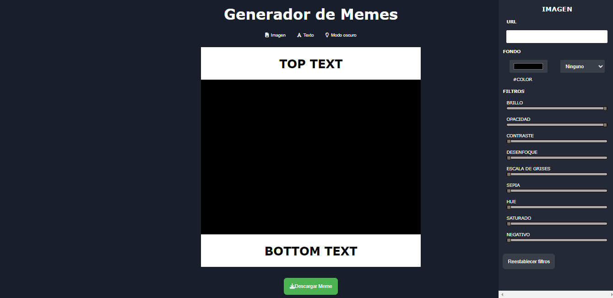

# ***This is my Meme Generator Project.*** 👋

## PREVIEW
 

## ¡Let's talk about the project! 

### This is the project of the second module of ADA ITW front end development course.

---

>## CONTENT: 📂

### 1- Section to modify image:

-- Add image with URL
-- Change background color
-- Change blend blackground mode
-- Background color image
-- Filters
-- Reset filters

### 2- Section to modify text: 

-- Edit top and bottom text
-- Remove text
-- Modify font family
-- Add font size
-- Change text color 
-- Modify background color text
-- Transparent background
-- Change text padding
-- Add text line height
-- Add alignment

>## FUNCTIONALITY⚡

 **Meme Generator** is an application used to manipulate the text and image of your meme and dynamically modify its content and properties. Also download your memes to use or share.

 ## Accesibility 🅰️

 This work has accessibility to browsers such as Google Chrome and Mozzilla Firefox.

 ---

 >## APPLIED TECHNOLOGIES ✅

 1. HTML: 💬

 2. CCS: 💬

 3. JavaScript 💬

>##### Link Github Repository: 📌
[click here](https://github.com/Gineskaespinoza/meme__editor)

---

>#### Link Deployment: 
[To view my project, click here](https://gineskaespinoza.github.io/meme__editor/)
